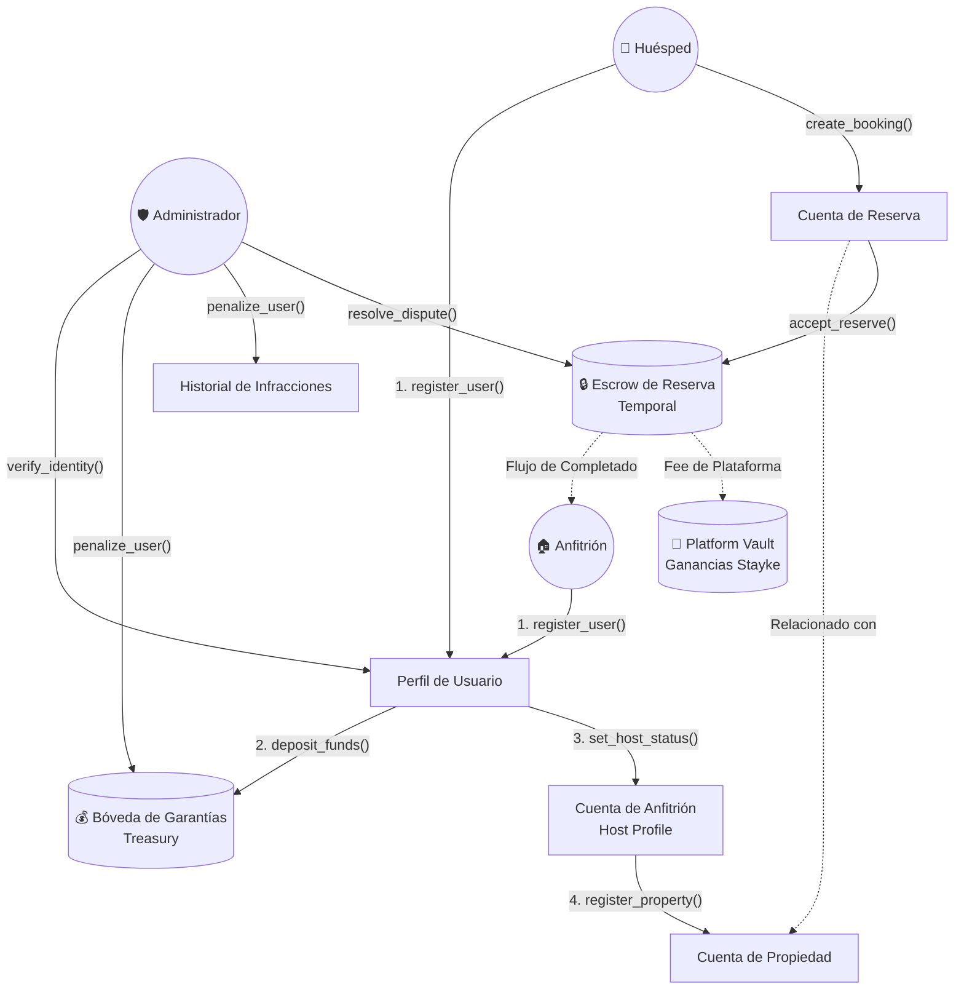
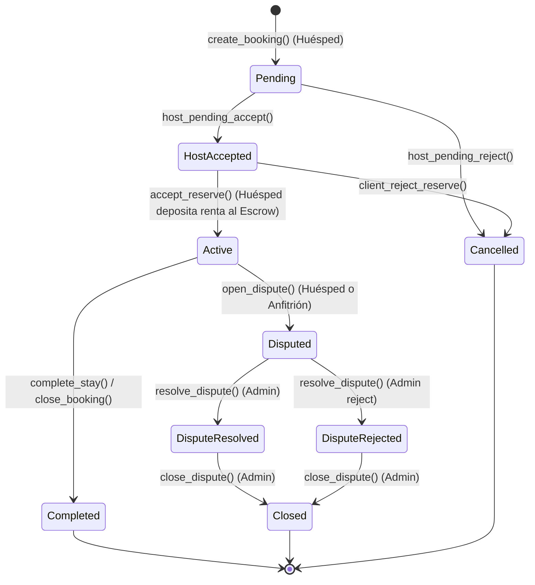
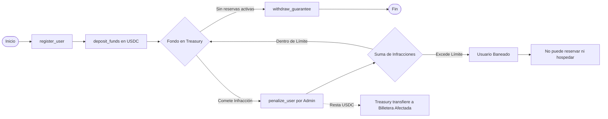

# Stayke System Flowchart

Este documento contiene diagramas que ilustran la arquitectura y los flujos principales del ecosistema Stayke.

## 1. Arquitectura General y Roles

Este diagrama muestra cómo interactúan los diferentes participantes (Huésped, Anfitrión y Administrador) con los distintos componentes y bóvedas del protocolo.

## 2. Ciclo de Vida de la Reserva (Booking Lifecycle)

El siguiente modelo de estados (State Machine) representa todas las fases por las que pasa una reserva y bajo qué instrucción (método) ocurre la transición.

## 3. Sistema de Garantías y Penalizaciones (Trust & Safety)

Diagrama detallado sobre qué ocurre con el depósito de capital en forma de garantía.

